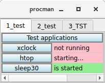
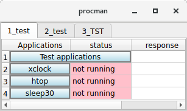

# procman
Compact GUI for deployment and monitoring programs and processes.<br>
<br>
The GUI can control multiple sets of programs arranged in tabs.

The 'status' column dynamically shows the color-coded status of programs.

The commands are executed by clicking in leftmost column.<br>
The top button executes table-wide commands:```Check All, Start All, Stop All```.<br>
It also holds commands to
- delete current tab (**Delete**),
- edit the table of the current tab (**Edit**),
- condense and expand table arrangement (**Condense and Uncondense**).

The following actions are defined for regular rows:
  - **Check**
  - **Start**
  - **Stop**
  - **Command**: will display the command for starting the server/application

Definition of actions, associated with a program, are defined in the 
startup dictionary of the python scripts, code-named as proc#_NAME.py. See examples in the config directory.

Supported keys are:
  - **'cmd'**: command which will be used to start and stop the server,
  - **'cd'**:   directory (if needed), from where to run the cmd,
  - **'process'**: used for checking/stopping the server to identify 
     its process. If cmd properly identifies the 
     server, then this key is not necessary,
  - **'shell'**: some serverss require shell=True option for subprocess.Popen(),
  - **'help'**: it will be used as a tooltip,

## Demo
  - ```python -m procman config/proc*.py```<br>
  or ```python -m procman -c config```<br
Control of all programs, defined in the ./config directory.
Each set of programs will be controlled in a separate tab.
  - ```python -m procman -c config proc1_test.py proc3_TST.py```<br>
Control two set of programs from the ./config directory.
  - ```python -m procman -i -c config```<br>
Interacively select config files from the ./config directory.<br>


